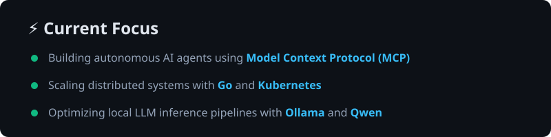
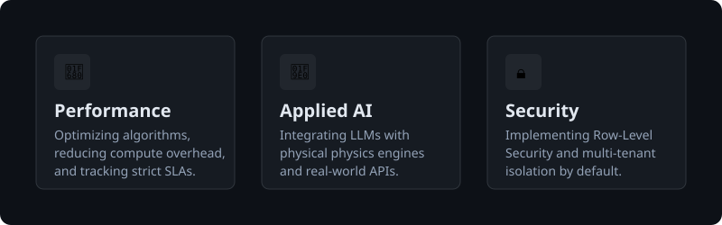

  

 

  
  
  
  

 

  

---

## 👨‍💻 About Me

I am an engineer focused on building **measurable, production-grade software**. I enjoy solving hard problems at the intersection of traditional backend engineering and applied AI.

- ⚙️ **Architecting** fault-tolerant backends and distributed systems.
- 🧠 **Integrating** local and cloud-based LLMs (MCP, RAG, custom pipelines) into real-world applications.
- ⚡ **Optimizing** latency, memory footprint, and compute for resource-constrained environments.
- 🔒 **Building** end-to-end applications with a strong emphasis on security (RLS, RBAC) and performance.

 

  

 

## 🛠️ Tech Stack

### Languages & Core

  
  
  
  
  
  

### Frontend

  
  
  
  
  
  

### Backend & Databases

  
  
  
  
  
  
  

### Cloud & DevOps

  
  
  
  

### AI / ML

  
  
  
  

 

## 🚀 Featured Projects

<table bordercolor="#161b22">
  <tr>
    <td width="50%" valign="top">
      <h3 align="center">Eco-Loop: Autonomous Building AI</h3>
       
      
An autonomous HVAC control agent using a locally-hosted Qwen2.5 LLM via Ollama. It cuts simulated energy consumption by 50% against a rule-based baseline while maintaining ASHRAE 55 comfort.

      <ul>
        <li><strong>Tech:</strong> FastAPI, React, Ollama, Qwen2.5, FastMCP, WebSockets</li>
        <li><strong>Metrics:</strong> 9-tool MCP server (0.006ms avg execution), 100% uptime fault-tolerant fallback.</li>
        <li><strong>Award:</strong> Honeywell Hackathon</li>
      </ul>
      

        
      

    </td>
    <td width="50%" valign="top">
      <h3 align="center">Rural Healthcare Platform</h3>
       
      
A full-stack bilingual telehealth platform with strict PostgreSQL Row-Level Security, Gemini-powered symptom triage, and spatial geo-search for nearby medical facilities.

      <ul>
        <li><strong>Tech:</strong> Next.js, TypeScript, Supabase, Postgres, PostGIS, Gemini API</li>
        <li><strong>Metrics:</strong> 274ms query latency via GIST spatial index, 197ms TTFB on Vercel Edge.</li>
      </ul>
      

        
      

    </td>
  </tr>
  <tr>
    <td width="50%" valign="top">
      <h3 align="center">TalentMatch AI</h3>
       
      
A stateless ATS resume-scoring pipeline that eliminates deep-learning dependencies for extreme performance. Uses TF-IDF for ranking and Groq API for explainability.

      <ul>
        <li><strong>Tech:</strong> Python, FastAPI, scikit-learn, Groq, Docker, Vite</li>
        <li><strong>Metrics:</strong> Sub 21ms ranking execution, 240MB Docker image, runs in &lt; 512MB RAM.</li>
      </ul>
      

        
      

    </td>
    <td width="50%" valign="top">
      <h3 align="center">CampusCart</h3>
       
      
A multi-tenant marketplace built with Flask Blueprints spanning 3 roles (Student, Vendor, Admin). Handles secure document uploads and isolated catalog generation.

      <ul>
        <li><strong>Tech:</strong> Python, Flask, SQLAlchemy, SQLite, Render</li>
        <li><strong>Metrics:</strong> 0% error rate benchmark, catalog queries in under 1ms.</li>
      </ul>
      

        
      

    </td>
  </tr>
</table>

 

## 📊 GitHub Analytics

  
  

 

  

 

## 🎯 Engineering Highlights

  

 

## ⏳ Journey

  

 

## 📜 Certifications

- **AWS Academy Graduate** – Cloud Architecting (60 hrs)
- **Machine Learning** – NPTEL / IIT Madras
- **Marketing Analytics** – NPTEL / IIT Kharagpur
- **AI Knowledge Challenge (Winner)** – IBM Call for Code
- **Computer Networking** – Coursera / Google

 

## 👾 Fun Section

  

  

 

  

    <a href="https://portfolio-nine-teal-m27r69k97q.vercel.app/">Portfolio</a> • 
    <a href="https://www.linkedin.com/in/arnavshukla09/">LinkedIn</a> • 
    <a href="mailto:arnavshukla0925@gmail.com">Email</a>
  

  <i>"Optimizing systems, one layer at a time."</i>

