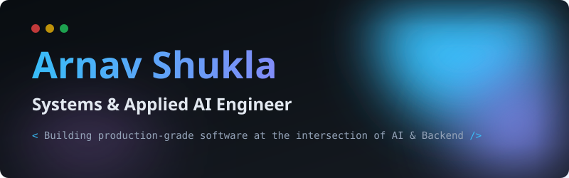
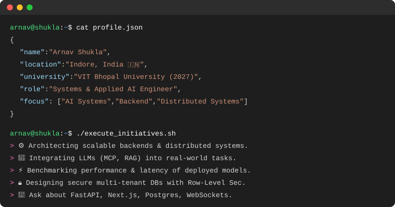
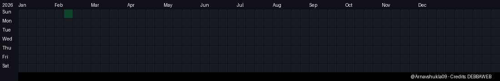

  

 

  

 

  
  &nbsp;
  
  &nbsp;
  

  
  &nbsp;
  
  &nbsp;
  
  &nbsp;
  

---

## 🏆 Achievements at a Glance

| 🏅 Honeywell Hackathon | 🥈 SIH 2025 | 🤖 IBM Call for Code | ☁️ AWS Certified |
|:---:|:---:|:---:|:---:|
| **Round 1 Shortlist** — Eco-Loop AI | Pitched **HealthSeva AI** at College Round | **Winner** — AI Knowledge Challenge | Academy Graduate — **Cloud Architecting** |

---

## 🚀 

 

---

## 💻 

### Languages

  
  
  
  
  
  

### Frontend

  
  
  
  
  

### Backend

  
  
  
  
  

### Database

  
  
  
  
  
  

### Cloud & AI

  
  
  
  
  
  

---

## 🛠️ 

<table bordercolor="#161b22">
  <tr>
    <td width="50%" valign="top">
      <h3>🏥 Rural Healthcare Platform</h3>
      
<i>Production Telehealth Platform</i>

      

        <code>Next.js</code>
        <code>PostgreSQL</code>
        <code>Supabase</code>
        <code>Gemini</code>
        <code>PostGIS</code>
      

      <ul>
        <li>✓ Strict Row-Level Security (RLS)</li>
        <li>✓ PostGIS Geo-search for facilities</li>
        <li>✓ Gemini AI Symptom Triage</li>
      </ul>
      

        
      

    </td>
    <td width="50%" valign="top">
      <h3>♻️ EcoLoop</h3>
      
<i>Autonomous Building AI</i>

      

        <code>FastAPI</code>
        <code>React</code>
        <code>Ollama</code>
        <code>EnergyPlus</code>
        <code>MCP</code>
      

      <ul>
        <li>✓ Qwen2.5 Local LLM Integration</li>
        <li>✓ 9-tool Model Context Protocol Server</li>
        <li>✓ Fault Tolerant WebSocket streaming</li>
      </ul>
      

        
      

    </td>
  </tr>
  <tr>
    <td width="50%" valign="top">
      <h3>📄 TalentMatch AI</h3>
      
<i>ATS Resume Ranking</i>

      

        <code>FastAPI</code>
        <code>Docker</code>
        <code>Groq</code>
        <code>TF-IDF</code>
        <code>Chrome Extension</code>
      

      <ul>
        <li>✓ Stateless High-Speed Ranking Pipeline</li>
        <li>✓ Optimized 240MB Docker Image footprint</li>
        <li>✓ Scikit-learn math with LLM explainability</li>
      </ul>
       
      

        
      

    </td>
    <td width="50%" valign="top">
      <h3>🛒 CampusCart</h3>
      
<i>Campus Marketplace</i>

      

        <code>Flask</code>
        <code>SQLite</code>
        <code>SQLAlchemy</code>
        <code>Wallet</code>
        <code>RBAC</code>
      

      <ul>
        <li>✓ Multi-role RBAC Architecture</li>
        <li>✓ Secure file uploads & simulated wallet</li>
        <li>✓ Blueprint Modular Routing</li>
      </ul>
       
      

        
      

    </td>
  </tr>
</table>

---

## 📊 

  

 

  

 

  

 

### 🏆 LeetCode Progress

  

 

### 🕹️ Contribution Tetris

  

